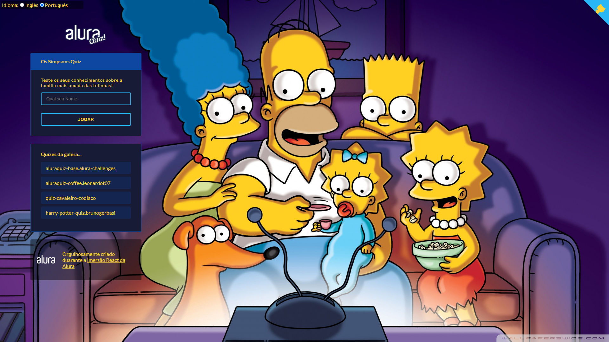
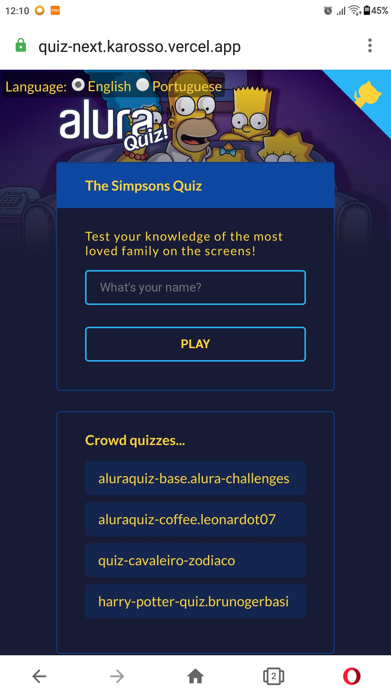

<h1 align="center">
    The Simpsons Quiz
</h1>

## 💻 Projeto

Projeto desenvolvido durante a [IMERSÃO REACT NEXT.JS](https://www.alura.com.br/imersao-react-next-js) da [Alura](https://www.alura.com.br/) apresentado pelo [@MArio Souto](https://github.com/omariosouto), [@Juliana Amoasei](https://github.com/JulianaAmoasei) e [@Paulo Silveira](https://github.com/peas). Na imersão desenvolvemos um quiz com React.js e Next.js e o tema que escolhi foi Os Simpsons.

O Quiz Dos Simpsons está disponivel em: [https://quiz-next.karosso.vercel.app/](https://quiz-next.karosso.vercel.app/)

## 📋 Tecnologias e técnicas utilizadas

Projetinho recheado de tecnologias, com destaque para:

- [Typescript](https://github.com/microsoft/TypeScript)
- [ReactJS](https://pt-br.reactjs.org/)
- [NextJS](https://nextjs.org/)
- [Styled Components](https://styled-components.com/)
- [Animação com Lottie](https://lottiefiles.com/featured)
- [Animações com Framer Motion](https://www.framer.com/motion/)

Utilizei o hook [Context](https://pt-br.reactjs.org/docs/context.html) do React para possibilitar a troca de idioma do Quiz e para utilizar diferentes bases de dados no menu Quizes da galera.

Do Next.js utilizei o [DataFetching](https://nextjs.org/docs/basic-features/data-fetching) para fazer o server side render dos quizes da galera.

### 💻 Web 

  

### 📱 Mobile 

  

